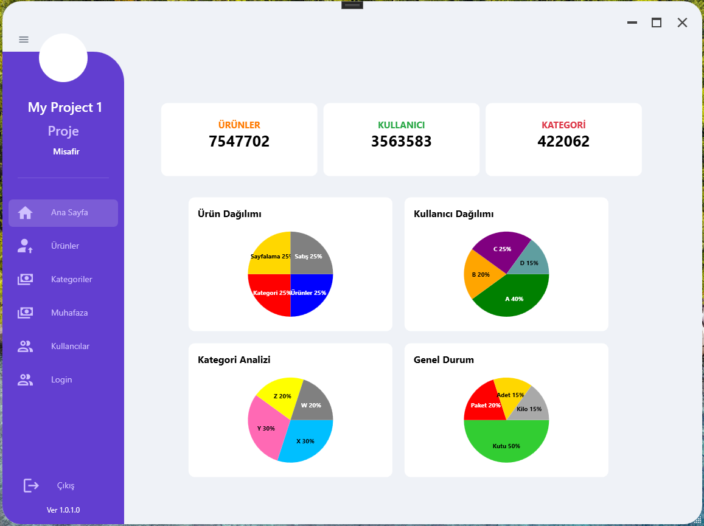
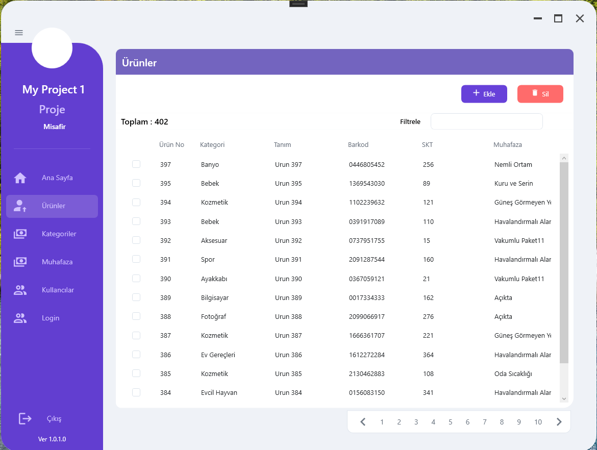
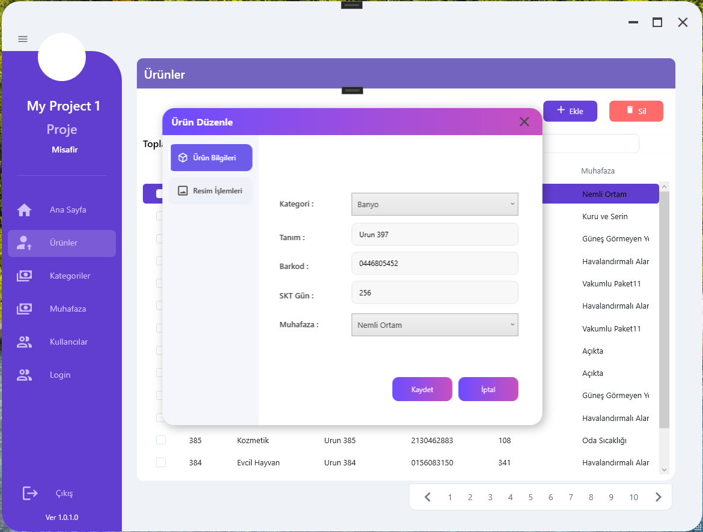
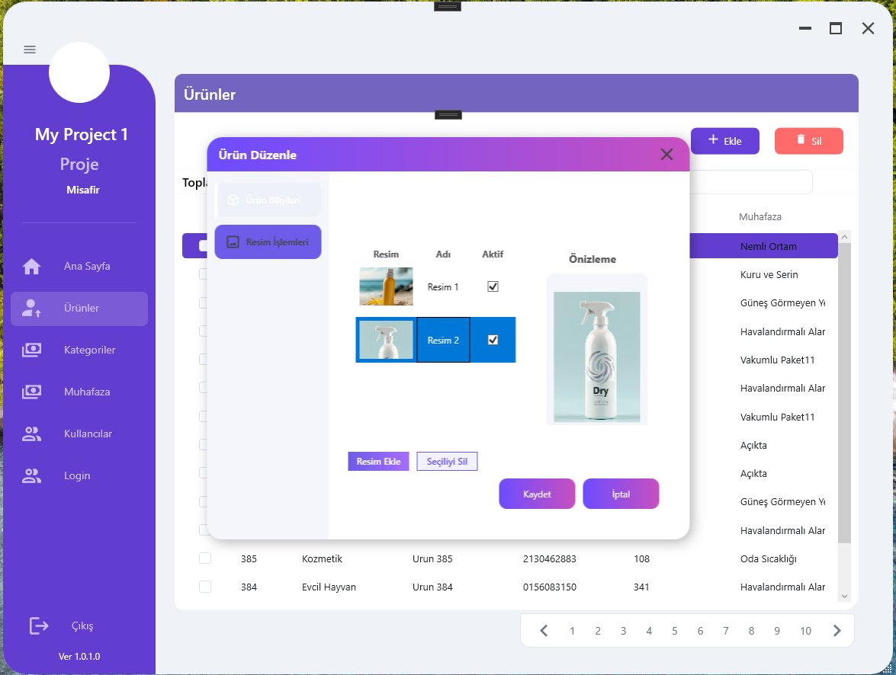
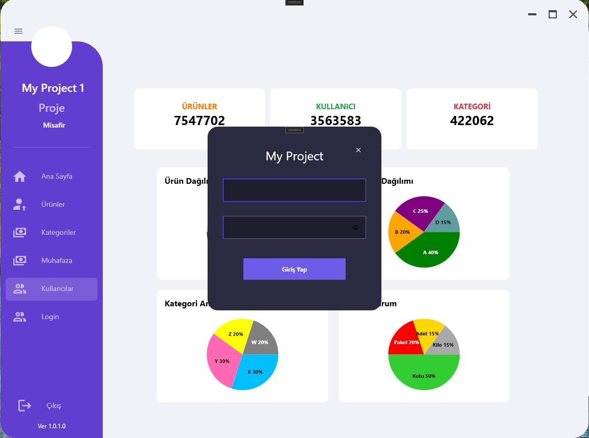

# MyProject2 - Desktop Business Application (.NET 10)

## Proje Hakkında
Modern bir masaüstü uygulaması olup, .NET 10 (Windows Application) ile geliştirilmiş ve SQL Server Stored Procedures odaklı veri erişim mimarisi kullanmaktadır.
   
🧩 Proje Hakkında   

Bu proje, katmanlı mimari yaklaşımıyla geliştirilmiş olup aşağıdaki bileşenleri içerir:
 
🖥️ WPF UI (Presentation Layer) → Kullanıcı arayüzü   
⚙️ Services Layer → İş mantığı   
🗄️ Repositories Layer → Veri erişimi (Stored Procedures)   
📦 Models Layer → Veri modelleri   
   
Uygulama, aktif kullanıcı yönetimi, ürün takibi, ve kategori bazlı veri organizasyonu gibi işlevleri destekler.   
    
<h2>⚡ Kullanılan Teknolojiler   </h2>
<ul>
<li>.NET 10 (Windows Desktop)</li>
<li>WPF (XAML)  </li>
<li>SQL Server  </li>
<li>Stored Procedures </li>
<li>C# (OOP & Layered Architecture) </li>
</ul>  
   

<h2>🧠 Teknik Detaylar</h2> 
<ul>
<li>Katmanlı Mimari (Separation of Concerns)</li>
<li>Stored Procedure tabanlı veri erişimi</li>
<li>Ölçeklenebilir ve sürdürülebilir yapı</li>
<li>Clean Code ve SOLID prensipleri</li>
<li>SQL tabanlı loglama sistemi</li>
</ul>

<h2>🧼 Clean Code</h2> 
<ul>
<li>SOLID principles</li>
<li>Dependency separation  </li>
<li>Maintainable codebase  </li> 
  </ul>
   
    
<h2>📊 Logging (Kayıt Sistemi)</h2>

Uygulama içerisinde gerçekleşen önemli işlemler ve hatalar, 
<b>SQL Server üzerinde ayrı bir log tablosunda</b> saklanmaktadır.

<ul>
<li>Kullanıcı işlemleri kayıt altına alınır</li>
<li>Hata (exception) logları tutulur</li>
<li>İşlem geçmişi izlenebilir</li>
<li>Sistem takibi ve hata analizi kolaylaştırılmıştır</li>
</ul>

  
🔐 Özellikler   
✔️ Aktif kullanıcı ile oturum yönetimi   
✔️ Stored Procedure tabanlı güvenli veri erişimi   
✔️ Katmanlı mimari (Clean Architecture yaklaşımı)   
✔️ Modüler ve genişletilebilir yapı   
✔️ Ürün & kategori yönetimi   
✔️ Dinamik UI bileşenleri   
    
🗄️ Veritabanı    
Proje, SQL Server üzerinde çalışmaktadır.    
Kurulum için:   
   
DatabaseScripts/init_database.sql dosyasını çalıştırın   
Stored procedure'leri yükleyin   
Connection string'i güncelleyin   
   
   
⚙️ Kurulum   
git clone https://github.com/yavuzclsknn/MyProject2.git   
Visual Studio ile aç   
Startup Project → MyProject2.Mutfak   
SQL bağlantısını ayarla   
Çalıştır 🚀   
    
Gerçek dünya senaryosu bazlı geliştirilmiştir   
Performans için stored procedure kullanımı   
Kurumsal mimariye uygun yapı   
    
⭐ Katkı    
Projeyi beğendiysen ⭐ vermeyi unutma!   
    

## 📸 Proje Görselleri   

### Windows Masaüstü Projesi Ekran Görüntüleri

  

  

  

  

  

